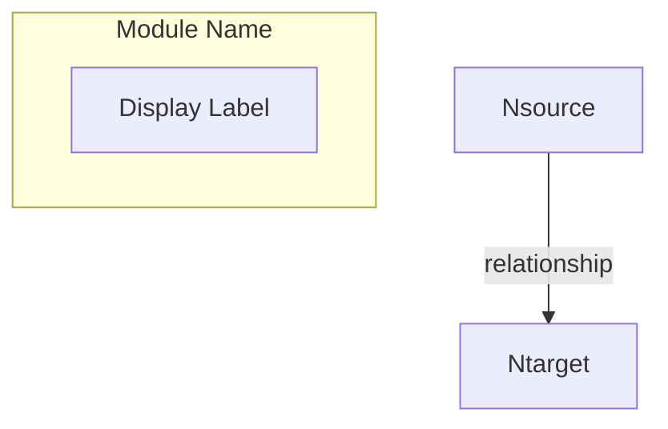

# Code Framework Graph Generator

This skill guides you to analyze code projects and generate hierarchical Mermaid diagrams that visualize architecture, dependencies, and relationships.

## Workflow Overview

```
1. Scan Project → 2. Identify Components → 3. Analyze Relationships → 4. Build Graph → 5. Generate MMD
```

---

## Phase 1: Project Scanning

### Step 1.1: Identify Entry Points
Scan for entry point files based on project type:

| Project Type | Entry Point Patterns |
|--------------|---------------------|
| Python | `main.py`, `app.py`, `__main__.py`, `cli.py`, `run.py` |
| Node.js | `index.js`, `app.js`, `server.js`, `main.ts`, `cli.ts` |
| Go | `main.go`, `cmd/*/main.go` |
| Java | `*Application.java`, `Main.java`, `*Main.java` |
| React | `App.tsx`, `App.jsx`, `index.tsx`, `main.tsx` |
| FastAPI | `main.py`, `app.py`, `router*.py` |

### Step 1.2: Map Directory Structure
Identify logical modules/directories and their purposes:
- Group files by directory/module
- Identify configuration files
- Note external dependencies (node_modules, venv, etc. should be excluded)

---

## Phase 2: Component Identification

### Step 2.1: Identify Node Types
For each significant file/component, classify as:

| node_type | Description | Examples |
|-----------|-------------|----------|
| `file` | Individual source file | `main.py`, `utils.js` |
| `module` | Logical grouping of files | `scanner/`, `utils/` |
| `directory` | Physical directory | `src/components/` |
| `external` | External service/dependency | `database`, `api` |

### Step 2.2: Determine Graph Level
Choose appropriate detail level:

| Level | When to Use | Shows |
|-------|-------------|-------|
| `high` | Architecture overview | Directory/module clusters |
| `module` | Component detail | Files within modules |
| `detailed` | Deep analysis | All relationships |

---

## Phase 3: Relationship Analysis

### Step 3.1: Identify Relationship Types

```python
class RelationshipType:
    IMPORT = "import"           # import/require statements
    INHERITANCE = "inheritance" # class extends/implements
    COMPOSITION = "composition" # has-a relationship
    REFERENCE = "reference"     # variable/parameter reference
    CALL = "call"               # function/method invocation
    IMPLEMENTATION = "implementation"  # interface implementation
```

### Step 3.2: Analyze Dependencies

For each file, identify:
1. **Imports**: What modules does it import?
2. **Exports**: What does it expose to others?
3. **Calls**: What functions/classes does it use?
4. **Data Flow**: What data passes between components?

---

## Phase 4: Build Graph Structure

### Core Data Structures

#### GraphNode
```python
{
    "id": "unique_identifier",        # Required: Unique ID (use file path or module name)
    "label": "Display Name",          # Required: Human-readable name
    "level": "high|module|detailed",  # Required: Detail level
    "node_type": "file|module|directory|external",
    "language": "python|javascript|...",  # Optional
    "metadata": {                     # Optional: Additional info
        "description": "...",
        "entry_point": true/false,
        "line_count": 100
    }
}
```

#### GraphEdge
```python
{
    "source": "source_node_id",       # Required: Source node ID
    "target": "target_node_id",       # Required: Target node ID
    "type": "import|call|inheritance|...",  # Required: Relationship type
    "weight": 1.0,                    # Optional: Relationship strength
    "metadata": {                     # Optional: Semantic info
        "semantics": {
            "business_description": "processes user data",
            "is_data_flow": true,
            "is_control_flow": false,
            "call_type": "async|sync",
            "direction": "oneway|bidirectional"
        }
    }
}
```

---

## Phase 5: Generate Mermaid Output

### Step 5.1: Build Graph JSON First

Before generating Mermaid, construct the graph JSON:

```json
{
    "high_level": {
        "id": "root",
        "label": "Project Root",
        "nodes": [],
        "edges": [],
        "children": [
            {
                "id": "scanner",
                "label": "Scanner Module",
                "nodes": [
                    {"id": "scanner/__init__.py", "label": "__init__.py", ...},
                    {"id": "scanner/parser.py", "label": "parser.py", ...}
                ],
                "edges": [...],
                "children": []
            }
        ]
    },
    "metadata": {...}
}
```

### Step 5.2: Convert to Mermaid Syntax

**Basic Template:**


---

## Execution Checklist

Track progress with this checklist:

```
Progress:
- [ ] 1. Identified entry points
- [ ] 2. Mapped directory structure
- [ ] 3. Classified node types
- [ ] 4. Analyzed imports/dependencies
- [ ] 5. Identified relationship types
- [ ] 6. Built graph JSON structure
- [ ] 7. Generated Mermaid diagram
- [ ] 8. Verified output correctness
```

---

## Tips for Quality Output

1. **Start with high-level view** - Show architecture before details
2. **Use meaningful labels** - Avoid cryptic abbreviations
3. **Group related nodes** - Use subgraphs for logical clustering
4. **Show critical paths** - Highlight entry points and core modules
5. **Limit edge density** - Too many edges reduce readability; filter to important relationships
6. **Add semantic context** - Describe what data/control flows between components
