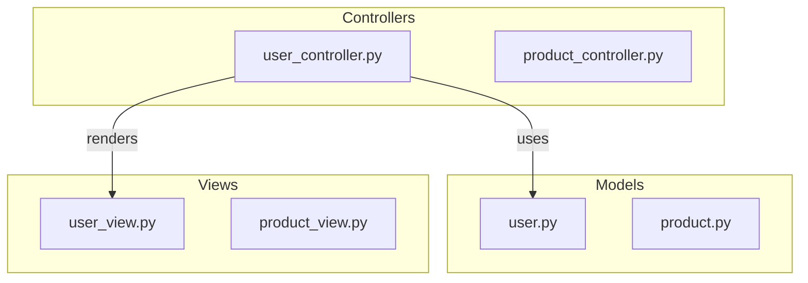

# Code Framework Graph Reference

## Detailed Relationship Type Guide

### Import Relationships

**Python:**
```python
# Various import patterns
import os                           # -> {"type": "import"}
from pathlib import Path            # -> {"type": "import"}
from . import utils                 # -> {"type": "import"}
from package.module import Class    # -> {"type": "import"}
```

**JavaScript/TypeScript:**
```javascript
import React from 'react';          // -> {"type": "import"}
import { useState } from 'react';   // -> {"type": "import"}
const fs = require('fs');           // -> {"type": "import"}
import * as utils from './utils';   // -> {"type": "import"}
```

**Go:**
```go
import "fmt"                        // -> {"type": "import"}
import (
    "github.com/pkg/module"         // -> {"type": "import"}
)
```

### Inheritance Relationships

**Python:**
```python
class Dog(Animal):          # -> {"type": "inheritance"}
class Service(BaseService): # -> {"type": "inheritance"}
```

**JavaScript/TypeScript:**
```javascript
class Button extends Component {}   // -> {"type": "inheritance"}
class Repository implements IRepository {} // -> {"type": "implementation"}
```

**Java:**
```java
public class UserService extends BaseService {} // -> {"type": "inheritance"}
public class UserRepository implements IRepository {} // -> {"type": "implementation"}
```

### Composition Relationships

```python
class Engine:
    pass

class Car:
    def __init__(self):
        self.engine = Engine()  # -> {"type": "composition"}
```

### Call Relationships

```python
# Function calls
result = process_data(input)    # -> {"type": "call"}
response = api.fetch()          # -> {"type": "call"}

# Method calls
user.save()                     # -> {"type": "call"}
database.query(sql)             # -> {"type": "call"}
```

---

## Node Metadata Examples

### Entry Point Marking
```json
{
    "id": "main.py",
    "label": "main.py",
    "level": "high",
    "node_type": "file",
    "language": "python",
    "metadata": {
        "entry_point": true,
        "description": "Application entry point, initializes services"
    }
}
```

### Core Module Marking
```json
{
    "id": "core/engine.py",
    "label": "engine.py",
    "level": "module",
    "node_type": "file",
    "language": "python",
    "metadata": {
        "core_module": true,
        "reference_count": 15,
        "description": "Core processing engine"
    }
}
```

---

## Common Project Patterns

### MVC Architecture


---

## Sanitization Rules

For Mermaid ID generation:

| Input | Output | Rule |
|-------|--------|------|
| `main.py` | `Nmain_py` | Replace `.` with `_` |
| `utils/helpers.py` | `Nutils_helpers_py` | Replace `/` and `.` with `_` |

**Implementation:**
```python
def sanitize_id(id_str: str) -> str:
    return "N" + "".join(c if c.isalnum() else "_" for c in id_str)
```
